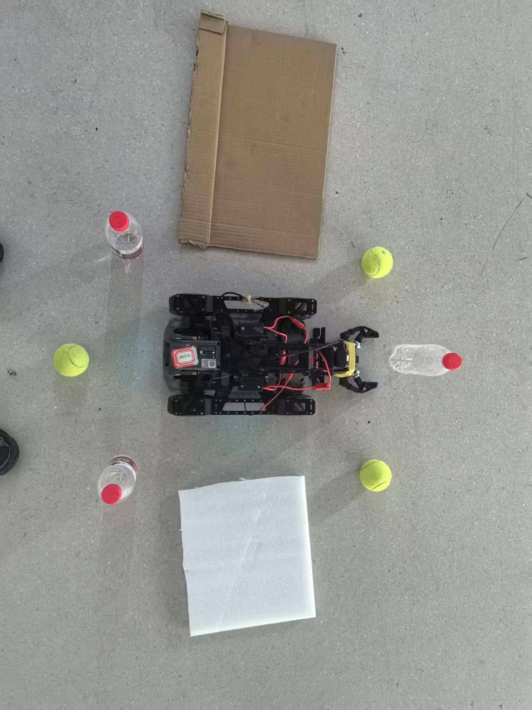
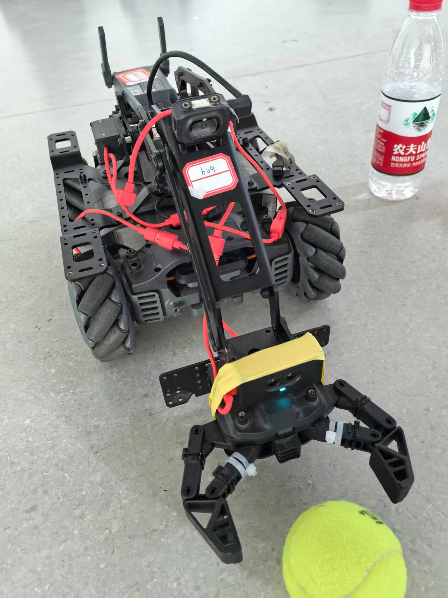
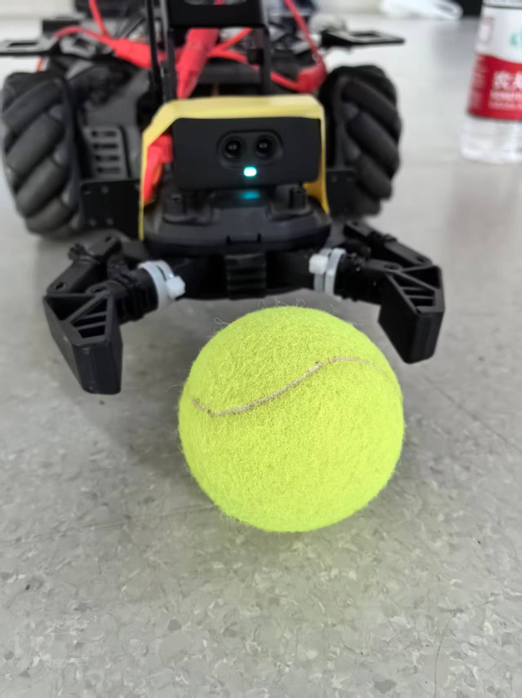

<!-- _class: cover -->
<!-- _paginate: false -->

# RoboMaster EP<br>视觉分拣

**Jetson × YOLO26**

网球与水瓶的自主识别、接近、抓取与分类放置

---

# 小组分工

| 成员 | 负责内容 |
| :--- | :--- |
| 许轩烨 | 总监、实机程序 |
| 占钟灵 | 仿真、程序 |
| 于瀚 | 模型、程序 |
| 公昕 | 仿真、程序 |
| 袁梓涵 | 场地搭建、PPT 制作 |

---

# 01　总览

**从视觉识别到实际分拣，建立完整任务流程。**

1. **总览**：任务目标、设备连接与系统分工。
2. **实机细节**：两个 demo，逐步走向正式分拣。
3. **模型训练**：独立章节，后续补充。
4. **仿真细节**：独立章节，后续补充。

---

<!-- _class: photo -->



# 两类物品，六个目标

围绕小车摆放 **3 个网球、3 个水瓶**。

相对小车启动朝向：
- **右侧区域放球**。
- **左侧区域放瓶子**。
- 每区固定 **三个角度放置位**。

<small>照片为实物布局；程序使用相对启动朝向定义左右。</small>

---

# 开发与控制连接

<div class="connection">
<div class="device"><h2>MacBook</h2><p>代码开发<br>终端远程控制<br>屏幕共享</p></div>
<div class="arrow">→</div>
<div class="device"><h2>Jetson OrinX</h2><p>运行 Python 程序<br>YOLO 图像推理<br>任务与动作控制</p></div>
<div class="arrow">→</div>
<div class="device"><h2>RoboMaster EP</h2><p>相机与红外反馈<br>底盘移动、转向<br>机械臂与夹爪执行</p></div>
</div>

**MacBook ↔ Jetson：SSH 操作终端，VNC 共享屏幕。**

**Jetson ↔ EP：Wi-Fi 连接，通过 SDK 传递图像、反馈与动作。**

---

# 02　实机细节

## 第一步　抓取—放置 demo
验证舵机映射、机械臂姿态和一次完整抓放。

## 第二步　视觉对准与距离调整 demo
物品偏离正前方时，自行转向、接近，再完成抓放。

## 第三步　正式分拣程序
维护待取方位与分类放置位，循环处理六个目标。

---

<!-- _class: photo -->



# 先确定实机几何关系

**原装相机**观察前方，图像中心作为默认抓取轴。

**红外模块在夹爪前端**，读数对应窗口前方物体表面；不是从底盘测距离。

**底盘侧舵机 ID1**：外伸 600，内收 1190。

**抓夹侧舵机 ID2**：先设 1073，随后保持固定。

<small>600、1190、1073 均为原始反馈单位，不是角度。</small>

---

<!-- _class: code -->

# 第一步：让一次抓放可靠运行

初态外伸、松爪。红外触发后夹紧，内收搬运，右转 90° 放置。
YOLO 独立记录检测结果，不参与本 demo 的动作判断。

```python
# ir_pick_place_demo.py · 核心动作节选
self.wait_for_object()
self.gripper(False, "grasp_close")
self.move_base(self.arm["base_retracted_raw"], "carry_retract")
self.turn(turn, "turn_to_place")
self.move_base(self.arm["base_extended_raw"], "place_extend")
self.gripper(True, "place_release")
```

<small>正常结束：内收回正，再恢复外伸松爪。异常：停止、身体红灯。</small>

---

<!-- _class: photo -->



# 第二步：对准以后再接近

**YOLO26m** 检测网球或瓶子，选取最靠近抓取轴的目标。

偏出画面宽度 **±4%** 时，每次转向 **5°**，停车后重新识别。

连续 **3 帧居中** 后检查红外；偏远时以 **4 cm/s、约 1 cm 一步** 接近。

<small>demo2 当前阈值为原始读数 ≤25 mm，连续3次；不等于实际2.5 cm。</small>

---

<!-- _class: code -->

# 第二步：视觉与距离共同放行

```python
# yolo_align_pick_place_demo.py · 判定节选
if stable >= a['stable_frames']:
    distance_state = self.infrared_state()
    if distance_state == 'ready':
        return target
    if distance_state == 'far':
        self.approach_step()
        stable = 0
```

**每次前进后重新对准，避免沿旧图像继续走。**

单个网球和单个瓶子均已实机跑通：抓取内收 → 沿路径回位 →
球向右、瓶向左 90° 放置 → 恢复初态。

---

# 第三步：从单次抓放到循环分拣

**搜索 → 对准接近 → 抓取 → 内收回位 → 分类放置 → 下一方位**

- 六个大致取物方向；每个方向记录 **待取 / 已取 / 未找到**。
- 球、瓶各维护三个放置位，按类别依次分配，已用位置不重复。
- 放置后 **松爪、内收**，转到下一搜索朝向，再外伸识别。
- 快速版按当前实际朝向，选择 **转角最小的待取方位**。

<small>正式程序：原始红外阈值24 mm，回位容差5 cm。六件整轮及三个放置角度仍待实机验证。</small>

---

<!-- _class: code -->

# 第三步：直接选择最近的待取方位

```python
# object_sorting.py · 当前快速版调度函数
def nearest_pending_direction(directions, current_heading):
    return min(
        (d for d in directions if d['status'] == 'pending'),
        key=lambda d: abs(align.wrap_degrees(
            d['heading'] - current_heading)),
        default=None)
```

完成放置后才标记 **taken**；没有目标标记 **not_found**。

**参考基准始终是启动中心与朝向**，放置后无需先回正搜索。
整轮结束再回正，并恢复外伸、松爪初态。

---

<!-- _class: divider -->

<div class="number">03</div>

# 模型训练

MODEL TRAINING

<!-- 本章仅保留背景与标题；后续补充具体内容。 -->

---

<!-- _class: divider -->

<div class="number">04</div>

# 仿真细节

SIMULATION

<!-- 本章仅保留背景与标题；后续补充具体内容。 -->

---

<!-- _class: refs -->

# References

## 01　RoboMaster EP 仿真模型
[jeguzzi / robomaster_ros](https://github.com/jeguzzi/robomaster_ros)

<small>EP 仿真与 ROS 接入参考资源</small>

## 02　Ultralytics YOLO 官方文档
[docs.ultralytics.com/models/yolo26/](https://docs.ultralytics.com/models/yolo26/)

<small>当前实机默认使用普通官方 yolo26m.pt。</small>
